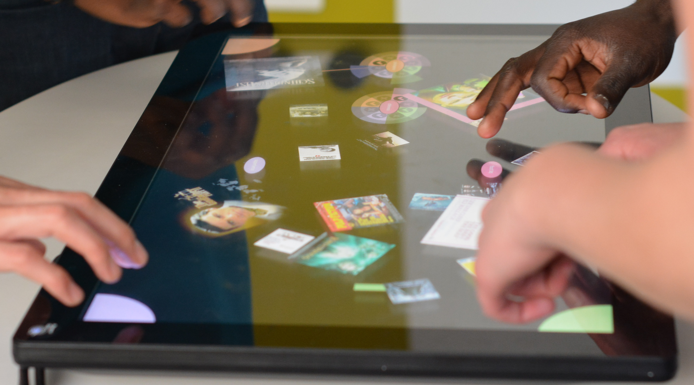

Responsable : Aurélien Tabard (<a href="mailto:aurelien.tabard@univ-lyon1.fr">aurelien.tabard@univ-lyon1.fr</a>), Valentin Lachand, Audrey Serna, Jean-Charles Marty.

Les tables interactives sont particulièrement appropriées pour faciliter les activités collaboratives (réunions, activités d'apprentissage).

L'objectif de ce projet est de développer des visualisations permettant aux participants comprendre leur participation relative dans l'activité et de l'ajuster pour un meilleur équilibre.

	

Attendus:

- Développement Python
- Projet en Open Source maintenu sur github
- Tenue d'un blog

Références :

[1] Lachand, V., Serna, A., Tabard, A., & Marty, J. C. (2016, October). De l’efficacité de visualisations indicielles ou symboliques pour la régulation d’activités collaboratives. In Actes de la 28ième conférence francophone sur l’Interaction Homme-Machine (pp. 144-154).
