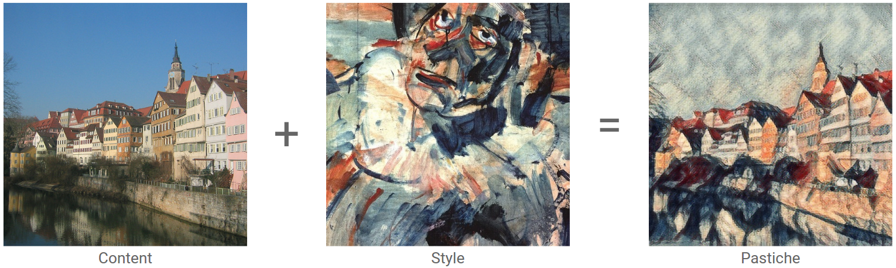

Responsable : Romain Vuillemot (<a href="mailto:romain.vuillemot@ec-lyon.fr">romain.vuillemot@ec-lyon.fr</a>) - <a href="http://romain.vuillemot.net/">http://romain.vuillemot.net/</a>

Le deep learning a révolutionné de nombreux domaines scientifiques : classification de données, detection de scènes dans les images, création de résumés vidéos, transfert de styles artistiques, conduite automatique de voitures, etc..

	

Nous souhaitons explorer les applications du Deep Learning dans le contexte de Data Visualization (DataViz), qiu consiste à transformer des donnés à des formes graphiques visuelles (carrés, cercles) qui leurs propriétés (taille, couleur). Ce processus est pour le moment réalisé manuellement pour chaque cas d'étude, non seulement pour le mapping visuel mais aussi les transitions ou le styling.

Le deep learning offre de nombreuses possibilités qui seront à explorer tout au long du projet :

* Créations automatiques de visualisations à partir de données
* Transition entre les visualisations
* Transfert de style entre plusieurs visualisation
* Compléter les données manquantes sur un graphique
* Création de légendes descriptives des visualisations

Les livrables attendus sont :

- Une documentation rigoureuse des outils et processus liés au deep learning; ainsi que leurs résultats
- La mise en open source de cette documentation, ainsi que tout le code qui a été nécessaire pour utiliser ces outils, et les paramétrer
- La tenue d'un blog et de comptes sur les réseaux sociaux afin d'avoir un feedback de cette communauté pour valider la progression en particulier dans le domaine de la data visualization.

Le choix du langage de programmation est libre (si de très bonnes connaissances) mais des approches Python (pour l'analyse de données) et Javascript (pour toute visualisation en particulier D3.js) seront préférées (notamment pour réutiliser des outils existants et facilement déployer le code).

References

[http://web.mit.edu/zoya/www/research.html](http://web.mit.edu/zoya/www/research.html)

[http://massvis.mit.edu/](http://massvis.mit.edu/)

[http://www.datasciencecentral.com/profiles/blogs/15-deep-learning-tutorials](http://www.datasciencecentral.com/profiles/blogs/15-deep-learning-tutorials)

[https://www.kaggle.com/c/digit-recognizer/forums/t/13084/kaggle-scripts](https://www.kaggle.com/c/digit-recognizer/forums/t/13084/kaggle-scripts)

[http://deeplearning.net/](http://deeplearning.net/)
