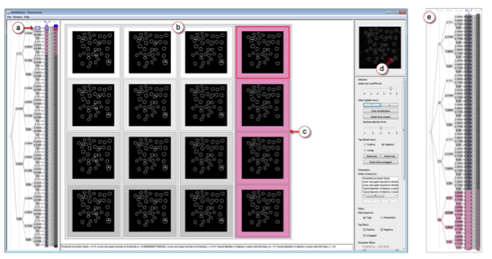

Responsable : Romain Vuillemot (<a href="mailto:romain.vuillemot@ec-lyon.fr">romain.vuillemot@ec-lyon.fr</a>) - <a href="http://romain.vuillemot.net/">http://romain.vuillemot.net/</a>

Les modèles de traitement automatique (classification, prédiction, ..) deviennent de plus en plus complexes. Ainsi, pour les choisir et configurer, dans le but d’optimiser leur sortie (précision, taux d’erreur, etc.), l’humain est souvent impliqué pour le choix des paramètres d’entrées (comme les valeurs de seuillage, choix de jeux d’essais, etc.) et utilise des valeurs classiques ou admises par la communauté, et les valide au moyen d’essais et d’erreurs. Des méthodes automatiques existent (grid search, random search, bayesian optimization, etc.) afin de rechercher les valeurs dans l’espace paramétrique qui est immense, mais l’humain intervient encore pour définir des intervalles de valeurs ou une manière de discrétiser les valeurs.

Ces approches ne sont pas toujours efficaces, pour plusieurs raisons : elles ne permettent pas de comprendre et parcourir complètement l’espace de recherche des paramètres; ne permettent que l’optimisation de paramètre quantitatifs déjà connus; même si une solution optimale est trouvé, il n’est pas possible d’expliquer pourquoi tel décision est prise (dans les cas complexes).

	

Le but du projet est de se focaliser sur de nouvelles méthodes d’optimisations de paramètres d’entrée de modèles, en incluant l’humain dans l’exploration de ces choix de paramètres. Ainsi, il sera possible pour un utilisateur de modèles de formuler rapidement plusieurs hypothèses sur le choix de paramètres, en visualiser les résultats, et les faire varier à nouveau pour comprendre le comportement d’un modèle, comme sa variabilité ou sensibilité à certains paramètres d’entrée comme les jeux d’essai. La visualisation permettant de faire l’interface entre de nombreuses variables et l‘humain, via des graphiques denses et interactifs (comme illustrés Figure 1). Le cas d’application est l’analyse d’image de part les besoins similaires actuels et futurs, et l’expertise du LIRIS dans ce domaine.

Les livrables attendus sont :

- Une documentation rigoureuse des outils et processus liés à l'exploration d'espaces paramétriques; ainsi que leurs résultats.
- La mise en open source de cette documentation, ainsi que tout le code qui a été nécessaire pour utiliser ces outils, et les paramétrer.
- La tenue d'un blog et de comptes sur les réseaux sociaux afin d'avoir un feedback de cette communauté pour valider la progression en particulier dans le domaine de l'analyse d'images et de la visualisation de données.

Le choix du langage de programmation est libre (si de très bonnes connaissances) mais des approches Python (pour l'analyse de données) et Javascript (pour toute visualisation en particulier D3.js) seront préférées (notamment pour réutiliser des outils existants et facilement déployer le code).

### Références

[Pretorius11] Pretorius, A. Johannes, et al. "Visualization of parameter space for image analysis." IEEE Transactions on Visualization and Computer Graphics 17.12 (2011): 2402-2411.

[Cancino12] Cancino, Waldo, Nadia Boukhelifa, and Evelyne Lutton. "Evographdice: Interactive evolution for visual analytics." 2012 IEEE Congress on Evolutionary Computation. IEEE, 2012.

[Mühlbacher14] Mühlbacher, Thomas, et al. "Opening the black box: Strategies for increased user involvement in existing algorithm implementations." IEEE transactions on visualization and computer graphics 20.12 (2014): 1643-1652.

[Ribeiro16] Ribeiro, Marco Tulio, Sameer Singh, and Carlos Guestrin. "" Why Should I Trust You?": Explaining the Predictions of Any Classifier." KDD (2016).
