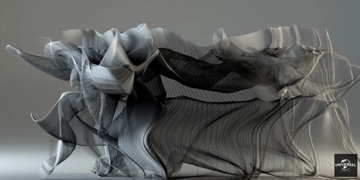

Responsable : Romain Vuillemot (<a href="mailto:romain.vuillemot@ec-lyon.fr">romain.vuillemot@ec-lyon.fr</a>) - <a href="http://romain.vuillemot.net/">http://romain.vuillemot.net/</a>

L’École Centrale de Lyon vient d’acquérir un dispositif de Capture de Mouvement (Motion Capture, ou MoCap), qu’elle a installé au sein de la plateforme Amigo (se situant sur le campuse de l'École à Ecully mais libre d'accès durant la duréee du projet). Ce dispositif est constitué de 6 caméras, de hautes définitions spatiale et temporelle (fréquence d’acquisition : 250Hz), permettant de suivre en temps-réel des marqueurs réfléchissants disposés sur un corps (humain, animal) ou sur un objet (robot, drone), pour en étudier précisément le mouvement.

La restitution visuelle proposée par le logiciel Nexus (fourni avec le MoCap) permet de rejouer l’animation grâce à une représentation simple utilisant des boules (les marqueurs) et des bâtons (les connexions rigides entre certaines boules). Ainsi, lorsque l’objet d’étude est un corps humain, avec ce logiciel nous voyons s’animer un squelette 3D.


	


Dans ce contexte, l’objectif principal du projet est de développer des programmes permettant de générer des rendus graphiques de mouvements plus sophistiqués que celui proposé par le logiciel (le rendu temps-réel n’est pas ici une contrainte, ce qui permet d’ouvrir le champ des possibilités). Nous proposons donc dans ce projet d’enrichir les rendus de mouvement 3D en tenant compte de différents descripteurs de mouvement, comme la vitesse du mouvement d’un bras, ou bien encore l’amplitude du mouvement, à l’instar des rendus réalisés par Tobias Gremmler (<a href="https://vimeo.com/163153865">http://vimeo.com/163153865</a>), cf image ci-dessus représentant un Kata de Kung-Fu. Nous attendons des étudiants qu’ils soient force de proposition aussi bien pour les aspects artistiques (rendu visuel), que pour le choix de descripteurs de mouvement pertinents et leur analyse/simplifications géométriques sur lesquels le rendu se basera.

Nature principale des travaux attendus :

* Expérimental : acquisition de séries temporelles par le dispositif de MoCap.
* Programmation : réalisation d’un logiciel de génération de vidéos de synthèse à partir des données expérimentales.


Livrables attendus :

- Le principal livrable consistera en la réalisation d’un logiciel permettant de générer des vidéos représentant l’animation simulée par ordinateur de mouvements 3D à partir des séries temporelles de marqueurs enregistrées par le MoCap. Ce logiciel sera utilisé pour générer plusieurs vidéos représentant des situations différentes imaginées par l’étudiant.
- Une documentation rigoureuse des outils et processus de création des; ainsi que leurs résultats
- La mise en open source de cette documentation, ainsi que tout le code qui a été nécessaire pour les générer et les reproduire.
- La tenue d'un blog et de comptes sur les réseaux sociaux afin d'avoir un feedback de cette communauté pour valider la progression.

Le choix du langage de programmation est libre (si de très bonnes connaissances) mais des approches Python (pour l'analyse de données) et Javascript (pour toute visualisation en particulier D3.js) seront préférées (notamment pour réutiliser des outils existants et facilement déployer le code).
