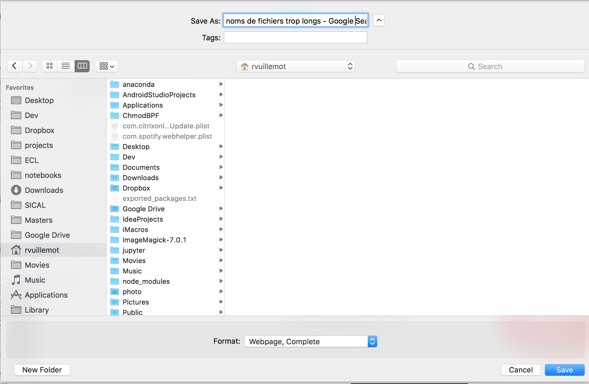

Responsable : Romain Vuillemot (<a href="mailto:romain.vuillemot@ec-lyon.fr">romain.vuillemot@ec-lyon.fr</a>) - <a href="http://romain.vuillemot.net/">http://romain.vuillemot.net/</a>

Les noms de fichiers sont des chaines de caractères associées à un document (image, texte, video). Même si ces noms sont très courants et très familier, attribuer un nom à un document reste encore un processus manuel. Cela demande du temps, et même si peu de ressources intellectuelles ou motrices sont nécessaires cela interrompt le flot de l'utilisateur ce qui occasionne ensuite un temps perdu pour la reprise d'activité et des erreurs ensuite.

L'objectif de ce projet est donc de mettre au point un système automatique (algorithme, modèle) de nommage de noms de fichiers, l'implémenter comme plugin d'un système d'exploitation (Mac, Windows) et tester avec des utilisateurs. Cet outil s'intègrera comme plugin d'un outil d'analyse de l'activité utilisateur [1] développé au LIRIS et écrit en Python (en Python).


	

Les étapes du projet sont les suivantes :

* Réaliser une taxonomie exhaustive des noms de fichiers (récolte automatique notamment via [1])
* Identifier des patterns sous-jacents de chaines et sous-chaines de caractère
* Indentifier les features nécessaires à la prédiction et mettre en place des heuristiques simples et les évaluer avec des utilisateurs

L'approche pour ce problème est libre, une préférence pour une implémentation en Python dans un environnement Mac est souhaitable. En particulier car cela permettra de s'intégrer avec l'outil Traces [1] développé au LIRIS qui permet de suivre l'activité d'un utilisateur et donc de lui recommander un nom de fichier dès qu'une boite de dialogue se présente.

Les livrables attendus sont :

- Une documentation rigoureuse des outils et processus de création de prédiction de noms de fichiers; ainsi que leurs résultats et tests avec données réelles
- La mise en open source de cette documentation, ainsi que tout le code qui a été nécessaire pour les générer et les reproduire
- La tenue d'un blog et de comptes sur les réseaux sociaux afin d'avoir un feedback de cette communauté pour valider la progression en particulier dans le domaine de la data visualization.

Une bonne connaissance du langage Python / programmation Mac est souhaitable.

[1] [https://github.com/activityhistory/traces](https://github.com/activityhistory/traces)
