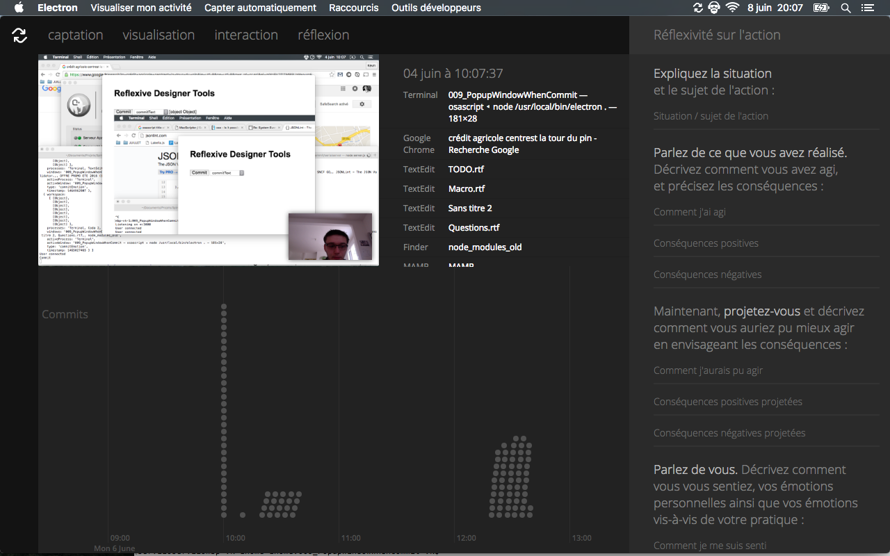

Responsable : Aurélien Tabard (<a href="mailto:aurelien.tabard@univ-lyon1.fr">aurelien.tabard@univ-lyon1.fr</a>)

Les interruptions font maintenant partie intégrante de notre vie. Plutôt que d'essayer de les éliminer, une approche alternative consiste à faciliter la reprise d'activité après une interruption.

L'objectif de ce projet est de construire un outil de visualisation pour naviguer dans des enregistrements d'activités passées. Exemple :


	

Attendus:
- Développement Web (nodejs, d3js, electron)
- Projet en Open Source maintenu sur github
- Tenue d'un blog
- Participation à des réunions hebdomadaires sur Skype avec l'université de San Diego

Références :

[1]  Rule A., Tabard A., Boyd K., and Hollan J. (2015) Restoring the Context of Interrupted Work with Desktop Thumbnails In 37th Annual Meeting of the Cognitive Science Society. (pp. 2045-2050). Pasadena, United States, Cognitive Science Society.
