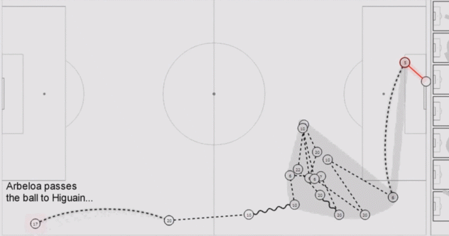

Responsable : Romain Vuillemot (<a href="mailto:romain.vuillemot@ec-lyon.fr">romain.vuillemot@ec-lyon.fr</a>) - <a href="http://romain.vuillemot.net/">http://romain.vuillemot.net/</a>

Les sports rassemblent des millions de personnes : professionnels, amateurs, journalistes et simples fans. Bien que la popularité et l'économie du sport soient indéniables, peu d'analyses ont été faites malgré le grand volume de données recueillies. Il y a donc un potentiel très important d'exploitation de ces données, au delà de simples statistiques [1].

Le but de ce projet est de s'intéresser à un sport ou plusieurs sports en particulier (on privilégiera le foot et le tennis, mais d'autres peuvent être étudiés) et de mettre en place de nouvelles méthodes d'analyse et de visualisation. Ces nouvelles méthodes serviront à par exemple mieux comprendre des données historiques ou très récentes voir en temps réel pendant un match. Des cas d'application sur le résumé tactique automatique d'un match ainsi que la prédiction de résulsts de matches futurs.


	

Les livrables attendus sont :

- Une documentation rigoureuse des outils et processus de création d'analyse et de prédiction de données; ainsi que leurs résultats et tests avec données réelles issues d'observations de données sportives
- La mise en open source de cette documentation, ainsi que tout le code qui a été nécessaire pour les générer et les reproduire
- La tenue d'un blog et de comptes sur les réseaux sociaux afin d'avoir un feedback de cette communauté pour valider la progression en particulier dans le domaine de la data visualization.

Le choix du langage de programmation est libre (si de très bonnes connaissances) mais des approches Python (pour l'analyse de données) et Javascript (pour toute visualisation en particulier D3.js) seront préférées (notamment pour réutiliser des outils existants et facilement déployer le code).

Références

[1] Charles Perin, Romain Vuillemot, Jean Daniel Fekete. SoccerStories: A Kick-off for Soccer Visual Analysis. Proceedings of the 2014 Annual Conference on Human Factors in Computing Systems (CHI 2014), Apr 2014, Toronto, ON, Canada. ACM. Best Paper, Honorable Mention
